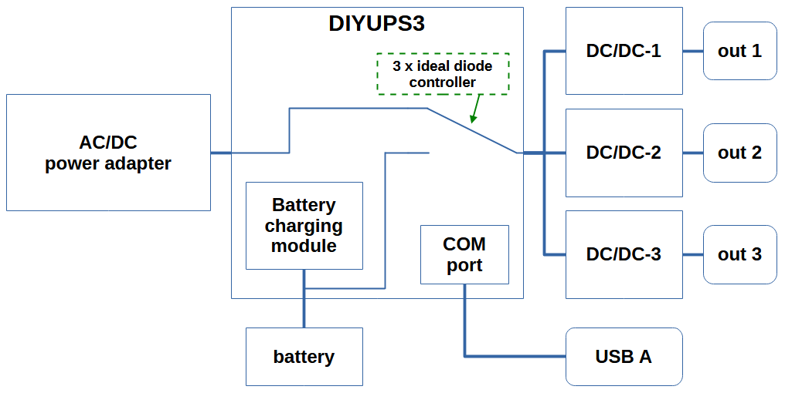
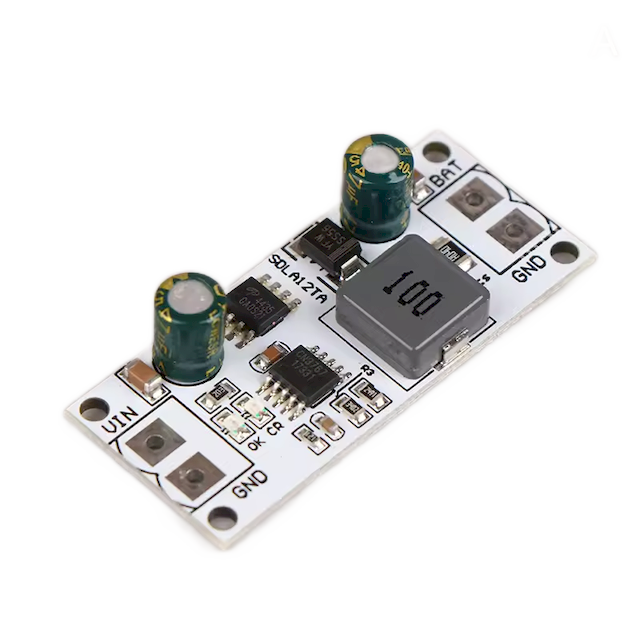
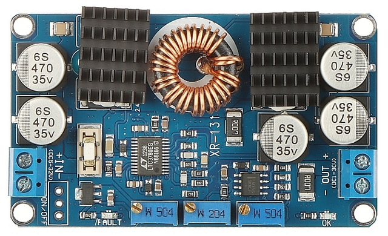
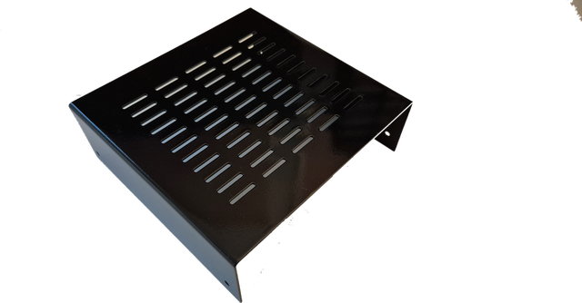
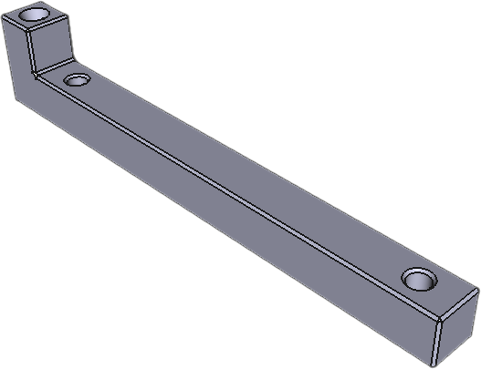
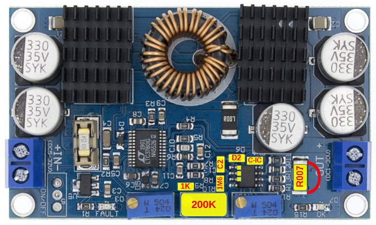
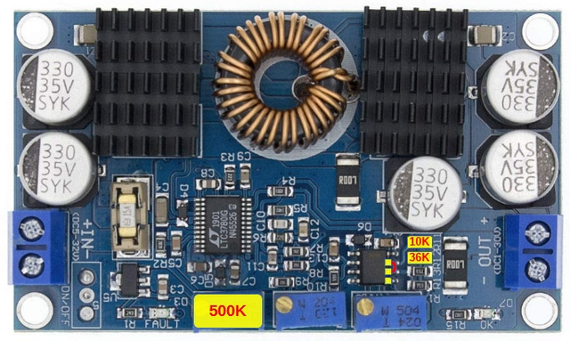
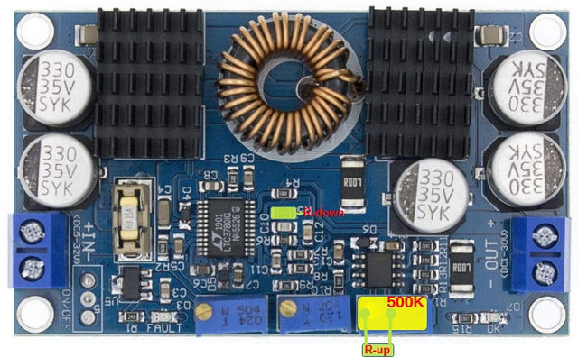
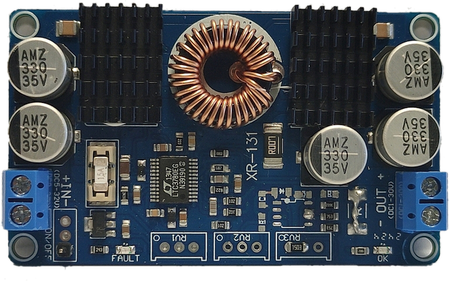

# DCzilla - DC DIY UPS Documentation

> ⚠️ **Important Notice**
> 
> **Personal Documentation:** This document is created for my personal use as a reminder and guide for the DCzilla DC UPS assembly procedure.
>
> **No Liability:** I assume no responsibility for any components, modules, procedures described herein, or any resulting damage or injury.
>
> **Use at Your Own Risk:** Users must verify all information independently and follow proper safety procedures.
>
**For full disclaimer, see Legal Notice section at the end of this document.**

&nbsp;

## Overview

DCzilla is a custom DC UPS (Uninterruptible Power Supply) solution designed to provide multiple configurable DC outputs without the inefficiency of multiple voltage conversions (AC→DC, DC→AC, AC→DC). The system can simultaneously output different voltages (5V, 9V, 12V, 15V, 19V) to power various devices such as routers, switches, mini-PCs, and single-board computers.

**Primary use case:** Ensure uninterrupted power to home network infrastructure, including devices like Dell Optiplex Micro, Raspberry Pi, routers, and network switches.

&nbsp;
## Key Features

- **Multiple outputs:** Up to 3 independent DC outputs, each configurable to 5V, 9V, 12V, 15V, or 19V
- **Smart battery management:** User-defined high/low voltage thresholds for automatic output control (Node-RED)
- **Configurable timing:** Customizable power-up and power-down delays for safe shutdown sequences (Node-RED)
- **Status monitoring:** Real-time status messages via COM port (Node-RED)
- **Battery voltage monitoring:** Continuous battery voltage tracking (Node-RED)
- **Modular design:** Uses pre-assembled DC-DC buck/boost converters and battery charging modules
- **Standard DC input:** 19-20V AC/DC supply (standard notebook adapter)
- **Lead-acid battery:** 12V, 7-9Ah SLA/VRLA battery (standard UPS type)
- **Fanless operation:** Silent operation without cooling fan
- **Compact design:** Width matches Dell Optiplex Micro (182mm)

&nbsp;

## System Architecture

### Block diagram

&nbsp;

<p align="left">
  <br>
  <sub></sub>
</p>
&nbsp;

### System Components

| Component | Description |
|-----------|-------------|
| **DIYUPS3 PCB** | Main control board with ATtiny1614 microcontroller |
| **DC/DC Converters** | LTC3780-based buck-boost modules (up to 3) |
| **Battery Charger** | SDLA12TA pre-assembled charging module |
| **Battery** | 12V 7Ah or 9Ah SLA/VRLA lead-acid battery |
| **Enclosure** | 1.5mm galvanized sheet metal, U-shaped design |
| **Front/Rear Panels** | 3D printed (7mm total thickness) |
| **PCB Holders** | 3D printed with M3/M4 threaded inserts |
| **Connectors** | XT60 (input), GX16 (outputs), USB-A (configuration) |
| **AC/DC Supply** | Standard notebook adapter (19-20V, ~100W+) |

&nbsp;

## Component Details

### DIYUPS3 Main PCB

The DIYUPS3 is the central control board of the system. Its key functions include: power distribution management, battery monitoring, DC/DC buck-boost bontrol (enable/disable) and device configuration/communication.

&nbsp;


&nbsp;

**System Architecture:**
The PCB is a straightforward design based on a three-path Ideal Diode ORing controller that automatically routes power from either the AC/DC adapter (19V when mains power is present) or the battery (12V during power outage) to the DC/DC buck-boost converters. This ensures seamless transition between power sources without interruption.
DC/DC converter control (enable/disable) is managed by the ATtiny1614 microcontroller based on battery voltage thresholds and configured timing parameters (tBx/tSx). The same microcontroller also handles battery voltage monitoring and serial communication via USB interface.
Battery charging is performed independently by a dedicated charging module (SDLA12TA) mounted directly on this PCB.

**Key features:**
- Accepts external DC power (19-20V) or battery power (12V)
- Three-path Ideal Diode ORing controller with MOSFET (Active OR'ing)
- ATtiny1614 microcontroller for management and monitoring
- PIN header for USB communication and DC/DC control
- Integrated battery charging module (SDLA12TA)
- Auto Mini Blade fuses for input, battery, and outputs
- Spring PCB Terminal Block connectors for DC/DC modules
- Screw terminals for DC input and battery connections

&nbsp;

### Battery Charger Module (SDLA12TA)

Pre-assembled charging module soldered directly onto the DIYUPS3 PCB.



**Configuration:** The original Rcs resistor (0.4Ω) should be replaced to achieve optimal charging current at 1/10 of battery capacity.

**Calculation formula:**

```
Rcs (Ω) = 0.12V / Ich (A)
```

**Rcs values for different battery capacities:**

| Battery Capacity | Charging Current | Rcs (SMD 1210) |
|------------------|------------------|----------------|
| 1.2 Ah | 120 mA | 1.0 Ω |
| 2.0 Ah | 200 mA | 0.6 Ω |
| 2.7 Ah | 270 mA | 0.444 Ω |
| 3.4 Ah | 340 mA | 0.353 Ω |
| 4.5 Ah | 450 mA | 0.266 Ω |
| 7.2 Ah | 720 mA | 0.166 Ω |
| 9.0 Ah | 900 mA | 0.133 Ω |

&nbsp;

### Lead-Acid Battery Specifications

- **Type:** SLA/VRLA (Sealed Lead Acid / Valve Regulated Lead Acid)
- **Voltage:** 12V nominal
- **Capacity:** 7Ah or 9Ah (9Ah recommended due to minimal price difference and same dimensions)
- **Availability:** Standard UPS battery, widely available

> **Important:** Ensure correct charging current by selecting appropriate Rcs resistor value.

&nbsp;

### DC/DC Buck-Boost Converters (LTC3780)

Pre-assembled modules based on the Analog Devices LTC3780 chip.



#### Modifications:

While the modules work without modifications, the following changes can be made:

#### Remove CC Function (Constant Current Control)

**Why:** Prevents fast/sensitive over-current triggering during device startup (e.g., HDD spin-up)

**Note:** LTC3780 Short circuit protection remains active

#### Replace CV Potentiometer with Fixed Resistor

**Why:** Eliminates voltage fluctuations caused by the high-resistance potentiometer (500kΩ) being sensitive to touch and contact issues in low-quality units
**Implementation:** Use SMD resistors (1206 for R-up, 0805 for R-down, resistor size match PCB layout)

#### Remove UVLO Function (Under-Voltage Lockout)

**Why:** UVLO is handled by ATtiny microcontroller with user-programmable settings

**Implementation:** Solder 1-pin header (M) behind IN connector, connect to DIYUPS3 with F-F jumper wire

**Note:** Both CC and UVLO functions are implemented on the same LM358 chip, simplifying the modification process.

&nbsp;

### LTC3780 Voltage Adjustment (Fixed Resistors)

**Formula:**

```
Vout = 0.8V × (1 + Rup/Rdown)
```

**Resistor values for output voltages:**

| Vout | R-down (Orig) | R-up (Orig) | R-down (Opt1) | R-up (Opt1) | R-down (Opt2) | R-up (Opt2) |
|------|---------------|-------------|---------------|-------------|---------------|-------------|
| 5V   | 14kΩ | 75kΩ | 10kΩ | 53.6kΩ | 6.8kΩ | 35.7kΩ |
| 9V   | 14kΩ | 123kΩ | 10kΩ | 102kΩ | 6.8kΩ | 98.8kΩ |
| 12V  | 14kΩ | 196kΩ | 10kΩ | 140kΩ | 6.8kΩ | 95.3kΩ |
| 15V  | 14kΩ | 249kΩ | 10kΩ | 178kΩ | 6.8kΩ | 121kΩ |
| 19V  | 14kΩ | 328kΩ | 10kΩ | 234kΩ | 6.8kΩ | 158kΩ |

> **Important:** Do not use R-down lower than 6.8kΩ

&nbsp;

### Metal Enclosure

- **Material:** 1.5mm galvanized sheet metal
- **Design:** Two identical U-shaped sections
- **Width:** 182mm (matches Dell Optiplex Micro)
- **Features:** Air circulation openings, mounting holes for PCB holders

 

&nbsp;

### 3D Printed Components and others

**Front/Rear Panels:**
- Total thickness: 7mm (5mm external + 2mm internal)
- Front: Logo only
- Rear: Connector cutouts

**PCB, Battery and Enclosure Holders:**
- Material: 3D printed plastic
- Hardware: M3/M4 threaded inserts, screws

<table border="0" cellpadding="0" cellspacing="0">
  <tr>
    <td align="center" valign="middle">
      <br>
      <small>Main PCB Holder(x2)</small>
    </td>
    <td width="30"></td>
    <td align="center" valign="middle">
      <br>
      <small>DC-DC Holder(x2)</small>
    </td>
    <td width="30"></td>
    <td align="center" valign="middle">
      <br>
      <small>Leg(x2)</small>
    </td>
  </tr>
</table>

<table border="0" cellpadding="0" cellspacing="0">
  <tr>
    <td align="center" valign="middle">
      <br>
      <small>Front Panel, Enclosure and Battery(x2)</small>
    </td>
    <td width="30"></td>
    <td align="center" valign="middle">
      <br>
      <small>Back Panel and Enclosure(x2)</small>
    </td>
  </tr>
</table>

&nbsp;

### Connectors

| Connector Type | Purpose | Quantity | Notes |
|---|---|---|---|
| XT60 (male) | DC input | 1 | Power supply input |
| GX16 (3 or 5-pin) | DC outputs | 3 | DC output, Pin 1=GND, Pins 2-5 for +voltages |
| USB Type A (female) | Communication | 1 | Configuration and monitoring |

**GX16 pin assignments (to avoid mismatch connection):**
- **Pin 1:** GND (common)
- **Pin 2:** 5V
- **Pin 3:** 12V
- **Pin 4:** 15V
- **Pin 5:** 19V

**Note:** 3-pin variant used for Dell Optiplex Micro with DS2501 power supply decoder chip.

&nbsp;

### External AC/DC Power Supply Requirements

- **Output:** 19-20V DC
- **Power rating:** >>100W (based on total load)
- **Connector:** XT60 male (replace original connector)

**DCzilla Design capacity:** ~100W total

- Mini PC (Dell Optiplex Micro): 10-50W
- Router: 15-25W
- Access point/switch: 15-25W

> **Important:** Always select a power supply rated above expected maximum load.

&nbsp;

## Software Configuration

### Command Reference

All commands use angle bracket format: `<command:value>`

&nbsp;

### Common Settings

| Command | Parameter | Range | Default | Test Value | Description |
|---------|-----------|-------|---------|------------|-------------|
| `<r0>` | — | — | — | — | Read common settings |
| `<vM:x>` | voltageMonitor | 0-1 | 1 | 1 | 0=OFF, 1=ON |
| `<cA:x>` | calibrAtion | 80-120 | 100 | 100 | Voltage calibration (100=no change) |
| `<pN:x>` | printNotes | 0-1 | 0 | 1 | 0=OFF, 1=ON |
| `<bP:x>` | batteryProtection | 0, 148-154 | 150 | 150 | Requires external module (set to 0) |

**`<r0>` response example:**

```json
{"vM":1,"cA":100,"pN":0,"bP":150}
```

#### Calibration (cA)

- **100** = no change
- **80** = -2% of reading (for 12V: 11.76V min)
- **120** = +2% of reading (for 12V: 12.24V max)

#### PrintNotes (pN)

When `<pN:1>` is enabled, the system sends detailed status messages via USB.

&nbsp;

### DC/DC-1 Settings

| Command | Parameter | Range | Default | Test Value | Description |
|---------|-----------|-------|---------|------------|-------------|
| `<r1>` | — | — | — | — | Read DC/DC-1 settings |
| `<tB1:x>` | timeBOOT1 | 1-900 | 300 | 10 | Boot delay (seconds) |
| `<tS1:x>` | timeSHDWN1 | 1-900 | 300 | 10 | Shutdown delay (seconds) |
| `<vH1:x>` | volt.High1 | 100-130 | 125 | 110 | Turn ON voltage (×0.1V) |
| `<vL1:x>` | volt.Low1 | 100-130 | 110 | 105 | Turn OFF voltage (×0.1V) |

**`<r1>` response example:**

```json
{"tB1":300,"tS1":300,"vH1":125,"vL1":110}
```

&nbsp;

### DC/DC-2 Settings

| Command | Parameter | Range | Default | Test Value | Description |
|---------|-----------|-------|---------|------------|-------------|
| `<r2>` | — | — | — | — | Read DC/DC-2 settings |
| `<tB2:x>` | timeBOOT2 | 1-900 | 1 | 10 | Boot delay (seconds) |
| `<tS2:x>` | timeSHDWN2 | 1-900 | 1 | 10 | Shutdown delay (seconds) |
| `<vH2:x>` | volt.High2 | 100-130 | 125 | 120 | Turn ON voltage (×0.1V) |
| `<vL2:x>` | volt.Low2 | 100-130 | 110 | 115 | Turn OFF voltage (×0.1V) |

**`<r2>` response example:**

```json
{"tB2":1,"tS2":1,"vH2":125,"vL2":110}
```

&nbsp;

### DC/DC-3 Settings

| Command | Parameter | Range | Default | Test Value | Description |
|---------|-----------|-------|---------|------------|-------------|
| `<r3>` | — | — | — | — | Read DC/DC-3 settings |
| `<tB3:x>` | timeBOOT3 | 1-900 | 600 | 10 | Boot delay (seconds) |
| `<tS3:x>` | timeSHDWN3 | 1-900 | 600 | 10 | Shutdown delay (seconds) |
| `<vH3:x>` | voltageHIGH3 | 100-130 | 125 | 130 | Turn ON voltage (×0.1V) |
| `<vL3:x>` | voltageLOW3 | 100-130 | 110 | 125 | Turn OFF voltage (×0.1V) |

**`<r3>` response example:**

```json
{"tB3":600,"tS3":600,"vH3":125,"vL3":110}
```

&nbsp;

### System Commands

| Command | Description |
|---------|-------------|
| `<reset>` | Reset all settings to default values |
| `<test1>` | Set all parameters to test values |
| `<ver>` | Display software version |

**Version response example:**

```json
{"ver":"7.2"}
```

&nbsp;

### PrintNotes Examples:

#### DC/DC-1 Message Sequence

**Voltage monitoring vH1 value:**

```json
{"DC/DC1 note": "Start vH1 monitoring"}
```

**vH1 reached. Turn-ON DC/DC1:**

```json
{"DC/DC1 note": "DC/DC 1 is ON, stop monitoring. Start tB1"}
```

DC/DC-1 activates. Voltage monitoring vH1 stop. Start timeBOOT1 timer (tB1). DC/DC1 is in ON state during tB1 time (proper boot procedure).

**timeBOOT1 completed:**

```json
{"DC/DC1 note": "Expired tB1. Start vL1 monitoring"}
```

timeBOOT1 (tB1) expired. Normal working mode. Start monitoring vL1.

**Voltage monitoring vL1 value:**

```json
{"DC/DC1 note": "vL1 detected, stop monitoring. Start tS1 countdown"}
```

Voltage monitoring vL1 stop. Start shutdown time (tS1). DC/DC1 is in ON state during tS1 time (proper shutdown procedure).

**Shutdown command (if tS1 > 10 seconds):**

```json
{"DC/DC1 note": "send shutdown command"}
```

This message is **always sent** regardless of pN setting when tS1 > 10 seconds. Use this in Node-RED to trigger graceful shutdown of NAS/PC.

**Shutdown time completed:**

```json
{"DC/DC1 note": "Expired tS1, DC/DC 1 is OFF, Waiting"}
```

timeSHDWN1 (tS1) expired. DC/DC-1 turns OFF. Waiting next cycle (vH1 monitoring,...).

**Note:** DC/DC-2 and DC/DC-3 follow the same message pattern with corresponding numbers.

&nbsp;

### Battery Protection (bP)

**Status:** Requires external Crowbar circuit (future), so set `<bP:0>` (disabled)

**Functionality:** When enabled (148-154), Attiny GPIO will activate Crowbar, input fuse will blow

**BOVP printNote message:**

```json
{"BOVP": true}
```

After 2 seconds, all DC/DC turn OFF. Reset requires disconnecting both battery and DC power supply.

&nbsp;

### Voltage Monitoring (vM)

- **Enable:** `<vM:1>` (500ms interval)
- **Disable:** `<vM:0>`

**When enabled, sends:**

```json
{"bV": 12.455}
```

Battery voltage in volts, updated every 500ms.

&nbsp;
&nbsp;

## Battery Voltage Threshold Configuration

### Understanding the Challenge

Battery-powered systems face a critical problem: **voltage hysteresis** causes oscillations that can damage equipment and reduce battery life.

**The problem:**
- **Voltage sag:** Battery voltage drops under load
- **Voltage recovery:** Voltage rises (~0.25V) when load is removed
- **Ping-pong effect:** Without proper thresholds, devices cycle on/off repeatedly

&nbsp;

### Solution: Smart Sequential Shutdown

By implementing adequate hysteresis (0.7-1.2V) between ON and OFF thresholds, combined with priority-based sequential shutdown, we can:

- Maximize uptime for critical equipment
- Protect battery health through controlled depth of discharge (DoD)
- Prevent rapid cycling that damages both battery and equipment

**Strategy:** Shut down the least critical consumer first, reducing battery load and allowing voltage recovery, thereby postponing shutdown of critical systems.

&nbsp;

### Battery Specifications

**12V 9Ah VRLA Battery example:**

| Parameter | Value |
|-----------|-------|
| Nominal voltage | 12V |
| Capacity | 9Ah @ 20°C |
| Internal resistance | ~14mΩ (fully charged) |
| Recommended discharge end voltage | 10.8V - 11.1V |

&nbsp;

### Example Load Configuration

| Device | Input Spec | Power | Current @ 12V* | Priority |
|--------|-----------|-------|---|---|
| Router | 12V 2A | 24W | 2.00A | Highest |
| PC | 19V 1.5A | 28.5W | 2.64A | Medium |
| NAS | 12V 2A | 24W | 2.00A | Lowest |
| **TOTAL** | — | **76.5W** | **6.64A** | — |

*Assuming 90% DC-DC converter efficiency

**Theoretical Runtime:**
- All devices: ~1.36 hours
- Router + PC only: ~1.94 hours
- Router only: ~4.5 hours

&nbsp;

### Recommended Voltage Thresholds

#### Strategy: Balanced

| Device | Boot/Shdwn | Turn ON | Turn OFF | Hysteresis |
|--------|----------|---------|----------|-----------|
| NAS | 3rd/1st | 13.00V | 12.30V | 0.70V |
| PC | 2nd/2nd | 12.70V | 11.90V | 0.80V |
| Router | 1st/3rd | 12.40V | 11.20V | 1.20V |

**Rationale:**
- **11.20V Router cutoff:** Protects battery from deep discharge while maximizing runtime
- **Hysteresis 0.7-1.2V:** Prevents oscillations with safety margin for voltage recovery

&nbsp;

### Operating Sequences

#### Power Restoration Sequence (During Charging)

| Step | Voltage | Action | Load Effect | Status |
|------|---------|--------|-------------|--------|
| 1 | 12.40V | Router turns ON | Voltage drops to ~12.20V | Critical device first |
| 2 | 12.70V | PC turns ON | Voltage drops to ~12.45V | Stable voltage confirmed |
| 3 | 13.00V | NAS turns ON | Full system operational | Battery nearly full |

**Note:** Charging typically continues to ~ 13.5 - 13.8V for full battery charge.

#### Shutdown Sequence (During Power Loss)

| Step | Voltage | Action | Voltage Recovery | Status | Result |
|------|---------|--------|---------|--------|--------|
| 1 | 12.30V | NAS shuts OFF | → 12.55V | Below PC ON (12.70V) | Load reduced, voltage stabilizes |
| 2 | 11.90V | PC shuts OFF | → 12.15V | Below Router ON (12.40V) | Further load reduction |
| 3 | 11.20V | Router shuts OFF | — | End of autonomy | System fully offline |

**Result:** No oscillations - each recovery voltage stays safely below the next device's turn-on threshold.

### Alternative Threshold Configurations

#### Option 1: Conservative (Extended Battery Life)

**Use case:** Battery longevity is critical, runtime is secondary

| Device | Turn ON | Turn OFF |
|--------|---------|----------|
| NAS | 13.00V | 12.40V |
| PC | 12.70V | 12.10V |
| Router | 12.40V | 11.50V |

#### Option 2: Maximum Runtime (Shorter Battery Life)

**Use case:** Maximum autonomy required, battery replacement acceptable

| Device | Turn ON | Turn OFF |
|--------|---------|----------|
| NAS | 13.00V | 12.20V |
| PC | 12.80V | 11.60V |
| Router | 12.50V | 10.80V |

### Important Notes

- **Voltage values in commands are in decivolts:** vH1:125 = 12.5V
- **Minimum hysteresis:** Maintain at least 0.7V between ON and OFF thresholds
- **Priority order:** Lowest priority device gets highest thresholds (shuts down first)
- **Voltage recovery:** Account for ~0.25V recovery when load is removed
- **No-oscillation rule:** Each device's recovery voltage must be below the next device's turn-on voltage

&nbsp;

## Installation and Setup

### Initial Configuration Steps

1. **Solder the appropriate resistor based on battery capacity**
2. **Solder battery charger module** on DIYUPS3 PCB
3. **Modify DC/DC converters** (optional but recommended)
4. **Set output voltages** via fixed resistors or potentiometers
5. **Mount components** in enclosure using 3D printed holders
6. **Connect wiring:**
   - DC input (XT60)
   - DC/DC module ON/OFF control wires
   - Output connectors (GX16)
   - USB configuration port (3 wire; GND, Tx, Rx)
   - Battery connections
7. **Configure device** via USB serial connection
8. **Test voltage thresholds** with actual load

> **Note:**
> - System will turn ON immediately, regardless of which power source is connected, external or battery
> - Battery needs to be connected before external power supply

&nbsp;
&nbsp;

## Node-RED Integration

**Flow:**
- Import flow in Node-RED
- Set COM port parameters

**Dashboard:**
At "Settings & Monitoring" page:
- Use buttons to Read/Clear Common parameters and each DC/DC parameters
- Use switch to enter device name for each DC/DC

At "Notes" page:
- Use Notes selector to set all or each DC/DC notes showing

&nbsp;
&nbsp;

## Safety Warnings

⚠️ **Important Safety Information:**

- Always disconnect power before servicing
- Observe correct battery polarity
- Use appropriate fuse ratings
- Do not short circuit outputs
- Battery can produce high currents - risk of fire/burns
- Ensure adequate ventilation
- Keep away from moisture
- Do not exceed rated power limits

&nbsp;

## Technical Specifications Summary

| Parameter | Value |
|-----------|-------|
| **Input voltage** | 19-20V DC |
| **Battery** | 12V 7-9Ah SLA/VRLA |
| **Output voltages** | 5V, 9V, 12V, 15V, 19V (configurable) |
| **Maximum power** | ~100W total |
| **Number of outputs** | Up to 3 independent |
| **Microcontroller** | ATtiny1614 |
| **Communication** | USB serial (JSON format) |
| **Dimensions** | 182mm width (Dell Optiplex Micro compatible) |
| **Cooling** | Fanless (passive) |
| **Fuse type** | Auto Mini Blade |

&nbsp;

## Revision History

| Current firmware version | Date | Changes |
|-------------------------|------|---------|
| 7.2 | 19.01.2026 | Initial full |

&nbsp;

## Comments, Questions and Other

For questions, suggestions, or bug reports, please contact the developer.

&nbsp;

**Recommended tools for configuration:**
- Serial terminal (PuTTY, Arduino IDE Serial Monitor)
- Node-RED

&nbsp;
&nbsp;

## LTC3780 Modifications and Comments

LTC3780 is DC/DC buck-boost converter IC. Pre-assembled modules featuring the popular LTC3780 chip (Analog Devices, 
[LTC3780 Rev G](https://www.analog.com/media/en/technical-documentation/data-sheets/ltc3780.pdf)) were used as the DC/DC converter.

After testing multiple modules, this one proved to be the best choice for this application. While some criticisms of this module 
can be found online, in my experience most issues are due to component defects (e.g., low-quality voltage regulation potentiometers) 
or improper handling (such as touching components in the voltage regulation circuit).

Since this module includes some functions that are unnecessary for this application, minimal modifications can be made.

### Modifications:

&nbsp;

#### Removal of the CC Function (Constant Current Control)

This function can be too fast or sensitive for demanding loads. Over-current protection may trigger when a connected device, such as an HDD, draws a higher current at startup.

It is important to note that removing the CC function does **not** disable module over-current protection. A short circuit at the output will still blow the fuse, protecting the module from damage.

<p align="left">
  <br>
  <sub>Yellow are CC components</sub>
</p>

&nbsp;

#### Removal of the UVLO Function (Under-Voltage Lockout)

This function prevents excessive battery discharge when running on battery. Since the same function is implemented in the ATtiny microcontroller (user-programmable), the module UVLO is not required.

To use UVLO via the microcontroller, solder a 1-pin header (M) to the pin behind the IN connector and connect it to the corresponding header on the DIYUPS3 using a jumper wire (F-F).

Both the CC and UVLO functions are implemented on the same chip (LM358), which simplifies the modifications.

<p align="left">
  <br>
  <sub>Yellow are CC components</sub>
</p>

&nbsp;

### Voltage Adjustment (CV)

The output voltage is controlled by a multi-turn potentiometer, which can be replaced with a fixed resistor. The potentiometer can cause voltage fluctuations due to its high resistance (500 kΩ) being sensitive to touch, or due to contact loss in low-quality units/parts. Replacing it with a fixed resistor solves both issues. Use a 1206 SMD resistor for R-up and an 0805 for R-down.

The formula for calculating resistors for different output voltages is:

```
Vout = 0.8V × (1 + R_up / R_down)
```

**Values for various voltages:**

| Vout | R-down (Orig) | R-up (Orig) | R-down (Opt1) | R-up (Opt1) | R-down (Opt2) | R-up (Opt2) |
|------|---------------|-------------|---------------|-------------|---------------|-------------|
| 5V | 14K | 75K | 10K | 53.6K | 6.8K | 35.7K |
| 9V | 14K | 123K | 10K | 102K | 6.8K | 98.8K |
| 12V | 14K | 196K | 10K | 140K | 6.8K | 95.3K |
| 15V | 14K | 249K | 10K | 178K | 6.8K | 121K |
| 19V | 14K | 328K | 10K | 234K | 6.8K | 158K |

> **Do not use R-down lower than 6.8K.**

<p align="left">
  <br>
  <sub>Yellow are Vout components</sub>
</p>

&nbsp;
&nbsp;

### All modification

<p align="left">
  <br>
  <sub></sub>
</p>

&nbsp;

<p align="left">
  <br>
  <sub></sub>
</p>

&nbsp;
&nbsp;

## Legal Notice and Disclaimer

### Purpose of This Document

This documentation is created exclusively for my personal use as a reference guide and reminder for the assembly, configuration, and maintenance of the DCzilla DC UPS system.

### Complete Disclaimer of Liability

I, the author of this documentation, assume **NO RESPONSIBILITY OR LIABILITY** for:

#### Components and Procedures

- The quality, safety, or suitability of any components, modules, or procedures described
- Any damage to equipment, property, or personal injury resulting from use of this information
- Any errors, omissions, or inaccuracies in the documentation
- The performance or reliability of pre-made modules, DIYUPS3 PCB, or any other components
- Defects, failures, or compatibility issues with any parts

#### Safety Hazards

- Electric shock, fire, explosion, chemical exposure, or burns
- Battery-related hazards including acid leakage and hydrogen gas
- Equipment damage or data loss
- Any consequential, indirect, or incidental damages

### User Responsibilities

Anyone using this information does so **entirely at their own risk** and must:

- Possess adequate knowledge of electronics and electrical safety
- Follow all applicable safety standards and local electrical codes
- Use appropriate personal protective equipment
- Verify all information independently and consult professionals when needed
- Monitor systems during operation and perform regular safety inspections
- Accept full responsibility for all risks

### Components Disclaimer

#### DIYUPS3 PCB (My Design)

The DIYUPS3 PCB is my personal design created for hobby/experimental purposes. I provide this design "as is" without any warranty, guarantee, or liability:

- No guarantee of safety, reliability, or fitness for any purpose
- No certification or compliance with any safety standards
- No liability for design errors, component failures, or PCB defects
- No responsibility for manufacturing quality or assembly errors
- Users assume all risks associated with building and operating this PCB

#### Pre-Made Modules

Pre-assembled modules (DC/DC buck-boost module LTC3780, battery charger module SDLA12TA, etc.) are third-party products:

- I am not affiliated with any module manufacturer
- Modules are used "as is" per manufacturer specifications
- I make no claims about their quality, safety, or suitability
- Module specifications may change without notice
- **I assume no responsibility for any modifications** to pre-made modules described in this documentation (including removal of CC, UVLO functions, replacement of potentiometers with fixed resistors, or any other changes)
- Users perform all modifications at their own risk and are solely responsible for any consequences

All users assume full responsibility for component selection, assembly, modification, and operation.

### Critical Warnings

Working with this system involves significant risks:

- **High currents** from batteries can cause severe burns and fires
- **Lead-acid batteries** contain corrosive acid and toxic materials
- **Improper connections** can destroy equipment instantly
- **Electrical faults** can cause electric shock, injury, or death

### No Warranty

This documentation is provided **"AS IS"** without warranty of any kind. Information may be outdated or incorrect.

### Acknowledgment

**If you are not qualified and willing to accept full responsibility for all risks, DO NOT attempt to build or operate this system.**

Use of this documentation constitutes acceptance of all terms in this disclaimer.

---

**Document Version:** 1.0  
**Last Updated:** January 2026  
**For personal use only**
